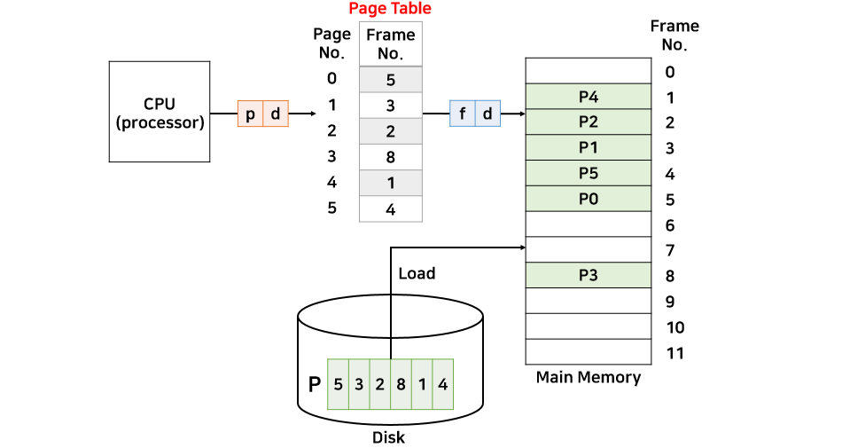
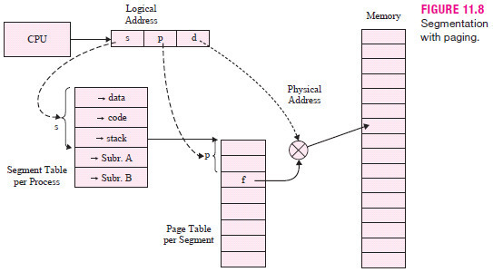

## 메모리 관리 전략


### 가상 메모리

> 메모리 관리 기법의 하나로 컴퓨터가 실제로 이용 가능한 메모리 자원을 추상화
>
> 이를 사용하는 사용자들에게 매우 큰 메모리로 보이게 만드는 것


- 가상 주소(virtual address) : 가상으로 주어진 주소

- 실제 주소(physical address) : 실제 메모리상에 있는 주소

- 메모리 관리 장치(MMU) : 가상 주소를 실제 주소로 변환

- **페이지 폴트**

  - 가상 메모리에 존재하고 실제 메모리(RAM)에 없는 데이터에 접근할 경우 

- **스와핑**

  - 페이지 폴트를 방지하기 위해 당장 사용하지 않는 영역을 하드디스크로 옮기고 필요할 때 다시 RAM으로 불러와 올림
  - 사용하지 않으면 다시 하드디스크로 내림을 반복
  - 프로세스 단위로 수행

- 스와핑 과정

  ```
  1. 운영체제는 CPU의 동작을 잠시 멈춘다.
  2. 운영체제는 페이지 테이블을 확인하여 가상 메모리에 페이지가 존재하는지 확인하고, 없으면 프로세스를 중단하고 현재 물리 메모리에 비어 있는 프레임이 있는지 찾는다. 물리 메모리에도 없다면 스와핑이 발동됨
      - CPU는 물리 메모리를 확인하여 해당 페이지(가상 메모리를 사용하는 최소 크기 단위)가 없으면 트랩을 발생해서 운영체제에 알린다.
  3. 비어 있는 프레임(실제 메모리를 사용하는 최소 크기 단위)에 해당 페이지를 로드하고, 페이지 테이블을 최신화한다.
  4. 중단되었던 CPU를 다시 시작
  ```

  > 실제 메모리의 단위 - 프레임
  >
  > 가상 메모리의 단위 - 페이지

- **지역성**

  - 공간 지역성
    - 현재 위치에서 가까운 데이터에 접근할 확률이 먼 거리에 있는 데이터에 접근할 확률보다 높다
  - 시간 지역성
    - 현재를 기준으로 가장 가까운 시간에 접근한 데이터가 더 먼 시간에 접근한 데이터보다 사용될 확률이 높다
  - 순차적 지연성
    - 여러 작업이 순서대로 진행되는 경향이 있다는 것을 의미

- **스레싱**

  - 메모리의 페이지 폴트율이 높은 것을 의미, 이는 컴퓨터의 심각한 성능 저하를 초래함

  - 스레싱은 메모리에 너무 많은 프로세스가 동시에 올라가게 되면 스와핑이 많이 일어나서 발생

  - 페이지 폴트가 일어나면 CPU 이용률 저하 -> 더 많은 프로세스를 메모리에 올림 -> 반복 -> 스레싱 발생

  - 해결 방법

    - 메모리를 늘리거나, HDD를 SDD로 교체

    - 작업 세트

      - 프로세스의 과거 사용 이력인 지역성을 통해 결정된 페이지 집합을 만들어서 미리 메모리에 로드하는 것

        -> 탐색에 드는 비용 절감, 스와핑 ↓

    - PFF(Page Fault Frequency)

      - 페이지 폴트 빈도를 조절하는 방법으로 상한선과 하한선을 만드는 방법
      - 상한선에 도달하면 페이지를 늘리고 하한선에 도달하면 페이지를 줄인다

  

  ### 메모리 할당

  >  메모리에 프로그램을 할당할 때는 시작 메모리 위치, 메모리의 할당 크기를 기반으로 할당

- 연속 할당

  - 메모리에 연속적으로 공간 할당

  - 고정 분할 방식

    - 메모리를 미리 나누어 관리하는 방식

    - 메모리가 미리 나뉘어 있기 때문에 융통성이 없고 내부 단편화가 발생

    - 내부 단편화 : 메모리를 나눈 크기보다 프로그램이 작아서 들어가지 못하는 공간이 많이 발생하는 현상

      

  - 가변 분할 방식

    - 매 시점 프로그램의 크기에 맞게 동적으로 메모리를 나눠 사용

    - 내부 단편화는 발생하지 않고 외부 단편화가 발생할 수 있다.

    - 외부 단편화 : 작업보다 많은 공간이 남아 있더라도 실제로 그 작업을 받아 들이지 못하는 경우

      

- 불연속 할당

  - 현대 운영체제가 사용하는 기법, 메모리를 연속적으로 할당하지 않음

  - 페이징 기법

    - 프로세스가 사용하는 메모리 공간을 잘게 나누어서 비연속적으로 실제 메모리에 할당하는 메모리 관리 기법

    - 대부분의 운영체제에서 관리하는 기본적인 메모리 관리 기법

    - 홀의 크기가 균일하지 않은 문제가 없어지지만 주소 변환이 복잡해짐

    - 필요 조건

      - 논리 주소 공간과 물리 주소 공간의 분리 - 주소의 동적 재배치 허용
      - 전용 하드웨어 (MMU) - 논리 주소와 물리 주소의 변환

    - 논리 주소

      

      ```
      p : 페이지 번호, d : 변위 (변하지 않는 값), f : 프레임 번호
      Page size = 16bytes
      Page Table = 5,3,2,8,1,4
      논리 주소 50번지는 물리주소 몇 번지인가?
      
      테이블의 정보를 읽기 위해 논리 주소를 p와 d 값으로 나눠야 한다.
      d = 4 bit = 2
      -> 페이지 크기가 16byte = 2^4 이므로
      논리 주소 50 을 이진수로 나타내면 110010
      d = 4bit이므로 이진수의 뒤에서 4칸이 d(0010)에 해당, d를 제외한 나머지 2칸이 p(11)
      이진수 11은 십진수로 3 -> 페이지 테이블의 번호 3을 가리킨다.
      페이지 3번의 해당하는 프레임 번호는 8
      
      물리 주소를 구성하는 f의 값은 8이 됨
      -> 이진수로 1000
      f와 d를 조합하면 10000010
      -> 십진수로 130
      변위는 2이므로 8번째 프레임의 시작 주소는 130에서 2를 뺀 128번지(16*8)가 된다.
      ```

  - 요구(demanding) 페이징

    - 사용자가 요구할 때 해당 페이지를 메모리로 가져오는 것
    - Non-demanding 페이징은 모든 페이지를 처음부터 메모리에 올리는 기법
    - 페이지 부재가 발생한 경우 디스크에서 페이지를 읽어와야 하므로 일시적으로 시스템 성능 저하될 수 있음
    - 적절한 페이지 교체 알고리즘을 선택하여 페이지 부재의 빈도를 최소화 해야함

  - 세그멘테이션 

    - 페이지 단위가 아닌 의미 단위인 세그먼트로 나누는 방식
    - 프로세스를 코드와 데이터 등을 기반으로 나눌 수 있으며 함수 단위로도 나눌 수 있음을 의미
    - 공유와 보안 측면에서 좋으며 홀 크기가 균일하지 않은 문제 발생

  - 페이지드 세그멘테이션

    - 공유나 보안을 의미 단위의 세그먼트로 나누고, 물리적 메모리는 페이지로 나누는 것

    

    - 프로세스를 처음에 세그먼트 단위로 자른다.
    - 의미있는 단위로 나누게 되면 보호와 공유를 하는 측면에서 이점을 가질 수 있게 된다.
    - 세그먼트로 인한 외부 단편화 문제를 해결하기 위해 잘라진 세그먼트를 일정한 간격인 페이지 단위로 자르는 페이징 방법을 취한다.
    - 이후 메모리에 적재하면 페이징의 일정 단위로 다시 잘렸기 때문에 외부 단편화가 발생하지 않는다

    -> 이와 같은 경우는 테이블을 두 가지 모두 거쳐야 하므로 속도 면에서 조금 떨어진다.


### 페이지 교체 알고리즘

> 페이지 부재 발생시, 물리적 메모리에 올라와 있는 페이지 중 하나를 선택해서 디스크의 스왑 영역으로 보냄

- 스왑 영역

  - 일반적으로 디스크의 일부분을 할당하여 사용
  - 스왑 인  : 디스크 -> 메모리
  - 스왑 아웃 : 메모리 -> 디스크

- **선입 선출 알고리즘(First In First Out: FIFO)**

  - 물리적 메모리에 가장 먼저 올라온 페이지를 우선적으로 교체
  - 메모리를 증가해도 페이지 부재가 더 증가하는 이상 현상이 발생할 수 있음

  

  

- LRU 알고리즘 (Least Recently Used Alogorithm)

  - 가장 오래전에 참조가 이루어진 페이지를 우선 교체

  

- LFU 알고리즘 (Least Frequently Used Algorithm)

  - 메모리 내에 존재하는 페이지 중 과거 참조 횟수가 가장 적은 페이지를 교체
  - `Incache-LFU`: 메모리에 적재될 때부터 페이지의 횟수를 카운트 하는 방식
  - `Perfect-LFU`: 메모리 적재 여부와 상관 없이 페이지의 과거 총 참조 횟수를 카운트 하는 방식
    - 시간의 특성을 잘 반영하지 못함

  

- 클럭 알고리즘 (NRU or NUR)

  > NRU(Not Used Recently) 또는 NUR(Not Recently Used) 알고리즘

  - 하드웨어적 자원을 통해 기존(LRU, LFU) 알고리즘의 소프트웨어적 운영 오버헤드를 줄임

  - LRU처럼 가장 최근에 참조되지 않은 페이지를 대상으로 선정
  - 교체되는 페이지의 참조 시점이 가장 오래되었다는 것을 보장하지는 않음
  - 참조 비트를 순차적으로 조사하며 동작

  

  ```
  1. 프레임 내의 페이지가 참조될 때 하드웨어에 의해 1로 자동 세팅됩니다.
  
  2. 클럭 알고리즘은 한 바퀴 돌며 참조되지 않은 페이지의 참조 비트 값을 0으로 바꾼 후 지나갑니다.
  
  3. 참조 비트가 0인 페이지를 방문하면 해당 페이지를 교체합니다.
  ```

  - 페이지가 참조되면 1이 되고, 한 바퀴 도는 동안 사용되지 않으면 0이 되고
  - 다시 한 바퀴를 도는 동안 사용되지 않으면 교체 대상 페이지 선정
  - 시계 바늘이 한 바퀴 도는 동안 걸리는 시간만큼 페이지를 메모리에 유지
  - 2차 기회 알고리즘이라고도 부름

