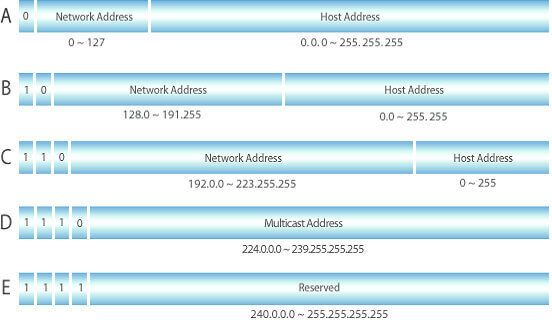

# IP 주소란

IP 주소는 Internet Protocol의 약자로 인터넷 네트워크에서 특정 노드를 식별하여 통신하기 위해 부여되는 네트워크상의 고유한 주소입니다. 각 주소는 네트워크 주소와 호스트 주소로 구분할 수 있으며 네트워크 주소가 같은 경우 같은 네트워크에 속한 노드입니다.

# IP 주소의 구분

IP 주소는 IPv4 / IPv6 가 존재하며 일반적으로 IP는 IPv4를 말합니다.

## IPv4

IPv4는 주소를 32비트 형식으로 표현하며 8비트 숫자 4개를 `.` 으로 구분하여 표시합니다.

이 방식으로 총 $2^{32}$ 개의 주소를 표현할 수 있는데 인터넷 장치 수가 급증하면서 IPv4 주솟값이 부족해져 IPv6 가 생기게 되었습니다.

> 예) 221.23.222.222

## IPv6

IPv6는 주소를 128비트 형식으로 표현하며 4비트 문자 4개를 한 블록으로 총 8개의 블록을 `:` 으로 구분하여 표시합니다. 총 $2^{128}$ 개의 주소를 표현할 수 있습니다.

> 예) 2001:0DB8:0000:0000:0000:0000:1428:57ab

IPv6는 IPv4에 비해 훨씬 많은 주소를 표현할 수 있게 되었을 뿐만 아니라 인증 및 보안, 효율성 측면에서도 개선이 이루어졌습니다.

# IP 주소의 할당

이러한 IP 주소를 할당하기 위해 1993년 이전에는 Class 기반으로 IP 주소를 할당했습니다. 그러나 네트워크 주소의 유연한 할당의 필요성이 커짐에 따라 CIDR 기반의 IP 주소 할당 방식이 표준이 되었습니다.

## Class 기반 할당 방식
기존에는 A, B, C, D, E class로 네트워크의 크기를 나누어 각 네트워크가 가질 수 있는 host의 수를 제한했었습니다. 이런 경우 필요한 네트워크 크기보다 훨씬 큰 네트워크를 할당받는 문제가 있었습니다.

예를 들어 255개의 호스트를 가진 네트워크의 경우 C class 가 가질 수 있는 호스트의 수 254개보다 단 하나의 호스트만 더 가지고 있는데 B class IP를 할당 받아 수만의 IP를 낭비하게 됩니다.

## CIDR 기반 할당 방식
CIDR 는 Classless Inter-Domain Routing의 약자로 클래스를 사용하지 않는 IP 분배 방식을 말합니다.

CIDR IP 주소는 비트 그룹이라고 불리는 두 개의 숫자 그룹으로 구성됩니다. 각 비트 그룹은 네트워크 주소와 호스트 식별자이며 다음과 같이 표현합니다.

> 예) 192.168.0.0/24

여기서 24의 의미는 해당 IP 주소를 비트로 표현하였을 때 앞에서부터 24개의 비트를 고정한다는 의미입니다. 이렇게 고정된 비트가 네트워크의 주소에 해당하며 나머지 비트를 사용하여 네트워크에 포함된 각기 다른 호스트 IP 주소를 표현할 수 있습니다.

